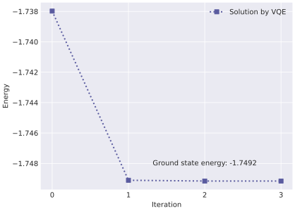

# Ground state energy for deuteron using VQE
## Introduction
mindquantum VQE算法教程。在本教程中，没有使用mindspore来搭建神经网络来训练量子线路，而是采用scipy来优化量子线路中的参数。对于不熟悉mindspore的学习者来说，能够更加容易地入门mindquantum。

In this tutorial, I will use *mindquantum* to get the ground state energy of deuteron. I will base this implementation off the paper [[1]](#1). In this paper, the authors performed the quantum circuit on IBM QX5 and Rigetti 19Q quantum chips to get the ground state energy of deuteron.

The Hamiltonian for deuteron is

$$
H_{N} = \sum_{n,n'=0}^{N-1}\langle n'|T+V|n\rangle a^{\dagger}_{n'}a_{n}.
$$

Here, the operator $$a_{n}^{\dagger}$$ and $$a_{n}$$ create and annihilate a deuteron in the harmonic oscillator *s* wave state. We map these operators onto qubits using Jordan Wigner transformation. We work with N=2. So the Hamiltonian written as 

$$
H_{2} = 5.906709I + 0.218291Z_0 - 6.125Z_1 - 2.143304(X_0X_1 + Y_0Y_1)
$$

## Perform the quantum simulation with *Mindquantum*
We import all the Python packages we need for this tutorial.
```python
import mindquantum as mq
import matplotlib.pyplot as plt
import numpy as np
import scipy.linalg as la
from scipy.optimize import minimize
```
We build the Hamiltonian as follows.
```python
def hamil():
    h = mq.QubitOperator('', 5.906709) + \
    mq.QubitOperator('Z0', 0.218291) +\
    mq.QubitOperator('Z1', -6.125) +\
    mq.QubitOperator('X0 X1', -2.143304) +\
    mq.QubitOperator('Y0 Y1', -2.143304)
    return mq.Hamiltonian(h) # 
```
In VQE algorithm, we often use UCC ansatz as wave function to determine the ground state energy of a Hamiltonian. The variational wave function takes the form $$U(\vec{\theta})|0\cdots1\rangle$$, where $$U(\vec{\theta})$$ is called ansatz in quantum computing. In our problem, $$U(\vec{\theta})$$ is defined as

$$
U(\theta) = \exp\left[\theta(a_{0}^{\dagger}a_{1} - a_{1}^{\dagger}a_{0})\right].
$$

Using Jordan-Wigner transformation, we have

$$
U(\theta) = \exp\left[\frac{i\theta}{2}(X_{0}Y_{1}-X_{1}Y_{0})\right].
$$

```python
def ansatz():
    T = mq.FermionOperator("0^ 1")
    Tdag = mq.hermitian_conjugated(T)
    qubit_ops = mq.Transform(T-Tdag).jordan_wigner()
    return mq.TimeEvolution(qubit_ops.imag, {'t': 1}).circuit
```
We perpare the Hartree-Fock initial state $$|01\rangle$$.
```python
def hf():
    circ = mq.Circuit()
    circ += mq.X(0)
    return circ
```
Next, We build the VQE circuit.
```python
    total_circuit = hf() + ansatz()
def vqe(hamil, total_circuit, init_amp=[0e-1]):
    sim = mq.Simulator("projectq", total_circuit.n_qubits)
    grad_ops = sim.get_expectation_with_grad(hamil, total_circuit,
    ansatz_params_name=ansatz().params_name)
    f, g = grad_ops(np.array(init_amp)) # ansatz parameters need numpy array
    return f[0, 0].real # f is a complex number
```
The ground state energy can be obtained by optimizing the paramter $\theta$. We use python module *scipy.optimize.minimize* to do this.
```python
result = minimize(lambda theta: vqe(hamil(), total_circuit, init_amp=theta), [0e-1])
```
Running all code above, we get the result. We plot the result for the optimized process.

<p align="center">
  
</p>
The ground state energy in this tutorial is -1.7492 MeV, which is very close to the result obtained in the paper. The source files for this tutorial can be taken from my github.


# Reference
<a id="1">[1]</a>
Dumitrescu E F, McCaskey A J, Hagen G, et al. [*Cloud quantum computing of an atomic nucleus*](https://journals.aps.org/prl/abstract/10.1103/PhysRevLett.120.210501)[J]. Physical review letters, 2018, 120(21): 210501.


